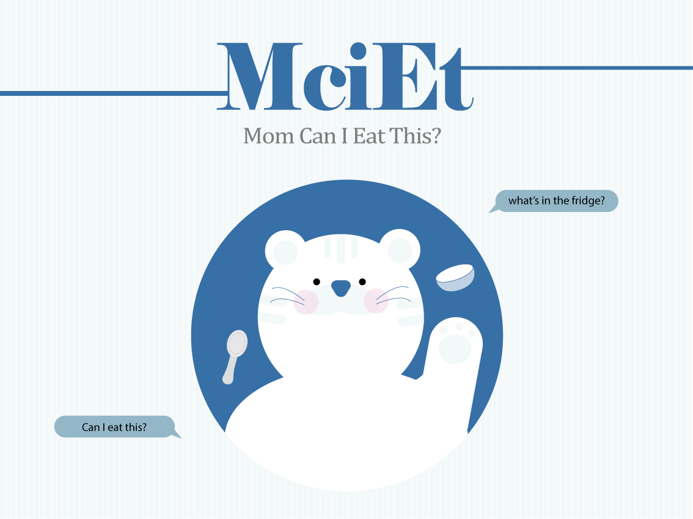
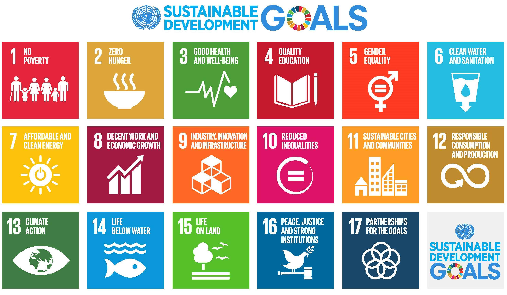
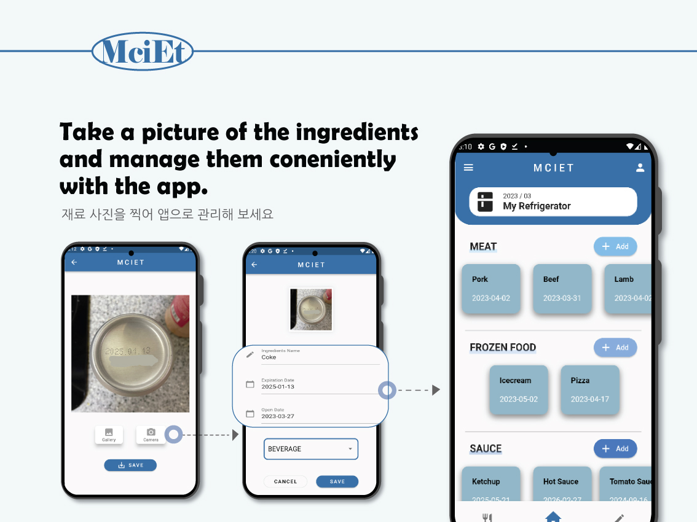
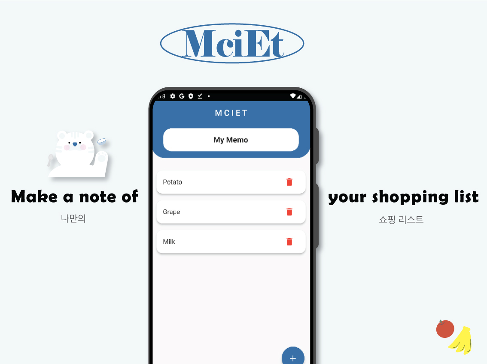
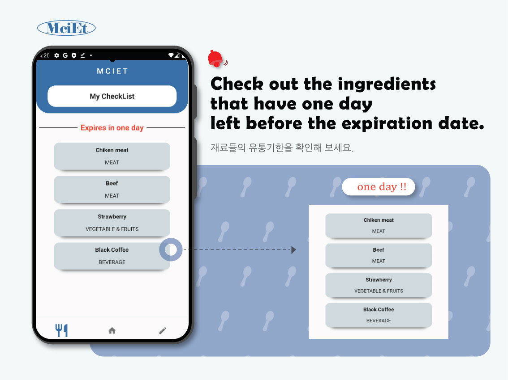
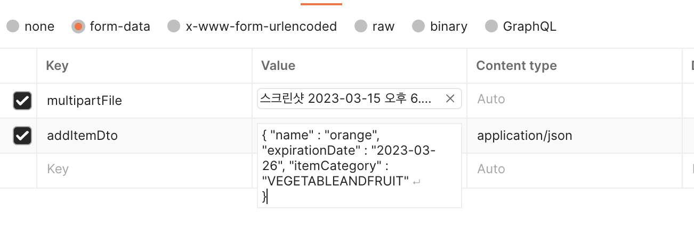

# MCIET, Mom can I eat this?



2023-MCIET-SolutionChallenge-Android

---

## CONTENTS
- [Meaning Of MCIET](#Meaning-Of-MCIET)
- [The United Nations 17 Sustainable Development Goals](#The-United-Nations-17-Sustainable-Development-Goals)
- [Technology Stack](#Technology-Stack)
- [Key Features](#Key-Features)
- [API Statement](#API-Statement)
- [Contributor](#Contributor)

---

## Meaning Of MCIET

---

We usually ask our mother if there are groceries in the refrigerator that we haven't seen before. Mom, can I eat this?

We don't always wonder how long the groceries have left their shelf life or how long they've been in the fridge unless we take them out to eat them. Therefore, there are many foods that are discarded without being able to check the expiration date in advance. We wanted to solve this problem, and we created an app called MCIET (Mom Can I Eat This?) that checks the expiration date that we don't know.

---


This bear name is Ciety! Hi Ciety!

---

## The United Nations 17 Sustainable Development Goals

---



The UN has 17 main objectives, including human universal, global environment, economic and social issues.

### Goals That We Will Achieve


#### **Goal 3: Good Health And Well-Being**

Our Android app has been developed to check the expiration date in real time, so you can keep your groceries fresh.


#### **Goal 12: Responsible Consumption And Production**

Our Android app was developed with the aim of minimizing discarded groceries, so we can achieve the UN's goal of 12, responsible consumption and production.

---

## Technology Stack

---


</a>
</a>
</a>
</a>

</a>
</a>

</a>
</a>
</a>
</a>
</a>

</a>
</a>


- App
  - Android
  - Flutter
  - Dart
  - Firebase
  - Google MLKit
- Design
  - Adobe Illustrator
  - Adobe Photoshop
- BE
  - Spring
  - Spring Boot
  - JPA
  - Maria DB
  - Java
  - AWS EC2
- ML
  - Tensorflow
  - Keras
  - Tensorflow-Lite

---

## Key Features

---







---

## API Statement

---

## localhost/item/add

- Storage Groceries
- method : **POST**
- Request
  - formData
    - key : multipartFile
    - value :
      - Photo :: Multipart (User Photo)
    - key : addItemDto
    - value :
      - name :: String (Groceries Name)
      - expirationDate :: String (Expiration date)
      - itemCategory :: String (Category)
- Response
  - Body
    - success : boolean (Success or Failure)
    - status : int (Status)
    - data :
      - itemId :: Long (Groceries Id)
    - successResponseMessage : String (Status Message)
    - timeStamp : String (Time)
  
### Request Example



### Response Example

```json
{
    "success": true,
    "status": 200,
    "data": 3,
    "successResponseMessage": "아이템 저장 완료",
    "timeStamp": "2023-03-25T05:48:27.356019"
}
```

## localhost/item/list

- Show List Of Groceries
- method : Get
- Request
  - Body
    - No Data
- Response
  - Body
    - success : boolean (Success or Failure)
    - status : int (Status)
    - `data` :
      - name :: String (Groceries Name)
      - expirationDate :: String (Expiration date)
      - remainExpirationDate :: int (Remaining Expiration Date)
      - itemCategory :: String (Category)
    - successResponseMessage : String (Status Message)
    - timeStamp : String (Time)

### Response Example

```json
{
    "success": true,
    "status": 200,
    "data": [
        {
            "name": "tomato",
            "expirationDate": "2023-03-26",
            "remainExpirationDate": 1,
            "itemCategory": "ETC"
        },
        {
            "name": "apple",
            "expirationDate": "2023-03-26",
            "remainExpirationDate": 1,
            "itemCategory": "VEGETABLEANDFRUIT"
        },
        {
            "name": "orange",
            "expirationDate": "2023-03-26",
            "remainExpirationDate": 1,
            "itemCategory": "VEGETABLEANDFRUIT"
        }
    ],
    "successResponseMessage": "아이템 리스트 조회 완료",
    "timeStamp": "2023-03-25T05:48:34.895257"
}
```

## localhost/item/{itemId}

- Show Groceries Details
- method : Get
- Request
  - Body
    - No Data
- Response
  - Body
    - success : boolean (Success or Failure)
    - status : int (Status)
    - `data` :
      - name :: String (Groceries Name)
      - expirationDate :: String (Expiration date)
      - filePath :: String (Groceries url)
      - remainExpirationDate :: int (Remaining Expiration Date)
      - itemCategory :: String (Category)
    - successResponseMessage : String (Status Message)
    - timeStamp : String (Time)

### Response Example

```json
{
    "success": true,
    "status": 200,
    "data": {
        "name": "orange",
        "expirationDate": "2023-03-26",
        "filePath": "https://mciet-bucket.s3.ap-northeast-2.amazonaws.com/2572965d-cb99-4729-a067-7149b2972870.png",
        "remainExpirationDate": 1,
        "itemCategory": "VEGETABLEANDFRUIT"
    },
    "successResponseMessage": "아이템 세부사항 조회 완료",
    "timeStamp": "2023-03-25T05:49:57.410041"
}
```

## localhost/item/{itemId}

- Delete Groceries
- method : Delete
- Request
  - Body
    - No Data
- Response
  - Body
    - success : boolean (Success or Failure)
    - status : int (Status)
    - `data` : null
    - successResponseMessage : String (Status Message)
    - timeStamp : String (Time)
  
### Response Example

```json
{
    "success": true,
    "status": 200,
    "data": null,
    "successResponseMessage": "아이템 삭제 완료",
    "timeStamp": "2023-03-25T05:53:32.791026"
}
```

## localhost/item/1day/list

- Show Groceries that have 1 day left before the expiration date
- method : Get
- Request
  - Body
    - No Data
- Response
  - Body
    - success : boolean (Success or Failure)
    - status : int (Status)
    - `data` :
      - name :: String (Groceries Name)
    - successResponseMessage : String (Status Message)
    - timeStamp : String (Time)

### Response Example

```json
{
    "success": true,
    "status": 200,
    "data": [
        {
            "name": "tomato"
        },
        {
            "name": "apple"
        },
        {
            "name": "orange"
        }
    ],
    "successResponseMessage": "유통기한 1일 남은 재료 조회 완료",
    "timeStamp": "2023-03-25T05:50:47.934013"
}
```

---

## Contributor

---


